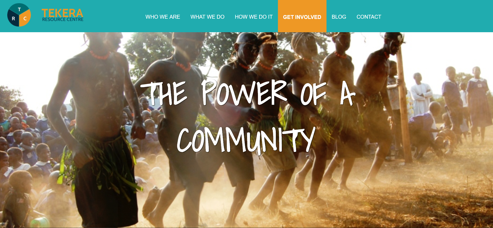
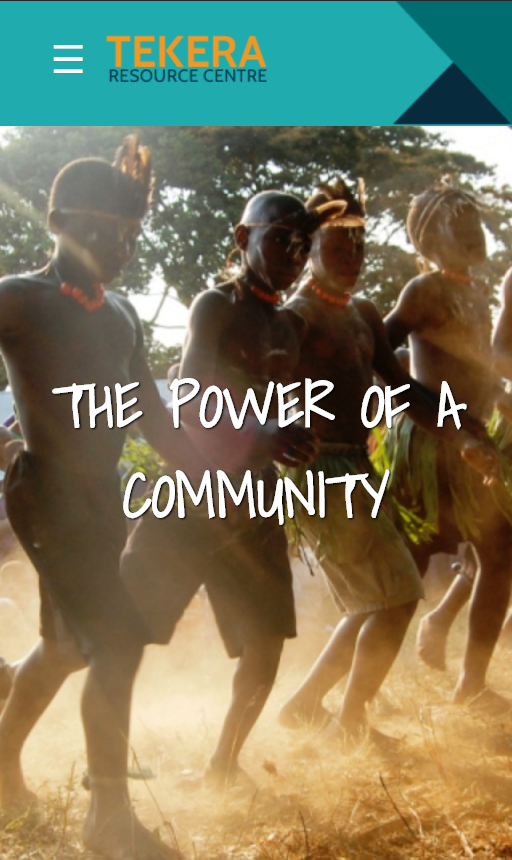

# Tekera Community Project
## Goal
To use HTML, CSS, jQuery, JavaScript, and PHP to create a custom dynamic WordPress theme which adequetly aligns with the designers' vision and meets the client's needs.

## ScreenShots
Desktop- Home Page

Mobile Width - Home Page

## Technology Used
* HTML
* CSS
* JavaScript
* PHP
* WordPress CMS
* WordPress Plugins: Contact Forms 7, Custom Field Suite, RED Functionality, Better REST API Featured Image, WP Migrate DB Pro
* Flickity CDN
* Visual Studio Code
* Gulp: Autoprefixer, CSS Nano, Uglify, Browser Sync, ES Lint
* GitHub

## Development Team
* Kelvin Lau
* Trevor McLean
* Sonia Wong
* Nate Schmidt
